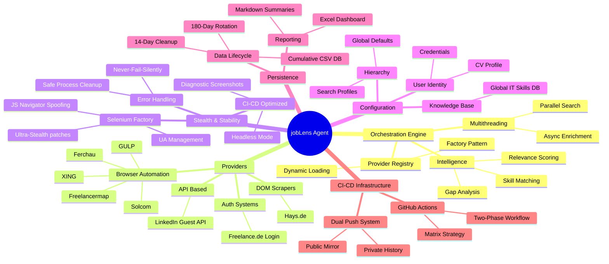

# 🏗️ jobLens: Technical Architecture & Implementation Analysis

This document provides a comprehensive overview of the **jobLens** automation agent's architecture, analyzing its modular components, data flow, and the advanced implementation techniques used to ensure reliability and stealth.

### 🧩 System Components Overview

*   **Orchestration Engine:** The system's core "brain" managing concurrent task execution, thread pooling, and multi-stage data evaluation.
*   **Providers:** Specialized market "probes"—modular components tailored to scrape and interact with specific job portals (API, DOM, or Selenium).
*   **Stealth & Stability:** A dedicated security layer designed for bot masking, language spoofing, and ensuring reliable browser automation in headless/cloud environments.
*   **Configuration:** A decoupled, hierarchical configuration system allowing for total behavior modification via JSON files without altering the source code.
*   **Persistence:** The system's data management layer, responsible for high-volume data consolidation, historical rotation, and professional Excel dashboard generation.
*   **CI/CD Infrastructure:** The automation motor providing serverless, scheduled, and autonomous system execution via GitHub Actions with a Dual-Push architecture.

## 1. System Philosophy
jobLens is built as a **Config-Driven, Modular Automation Agent**. Its primary goal is to transform fragmented job market data into a structured, prioritized database.

**Core Principles:**
- **Separation of Concerns (SoC):** Distinct layers for scraping logic, data processing, and orchestration.
- **Provider Pattern:** Portals are treated as pluggable modules.
- **Fail-Safe Execution:** The "Never-Fail-Silently" rule ensures that a failure in one provider doesn't compromise the entire scan.
- **Data Persistence:** Automated lifecycle management (Sync -> Rotate -> Clean).

---

## 2. Core Components Analysis

### 🚀 Orchestration Layer (`src/core/engine.py`)
The **JobSearchEngine** acts as the central conductor.
- **Multithreading:** Utilizes `ThreadPoolExecutor` for parallel searching and data enrichment.
- **Intelligence:** Implements a custom scoring algorithm that performs a "Gap Analysis" between job descriptions and the user's `my_profile.json`.
- **Optimization:** Features a `SUPPORTS_LOCATION_FILTER` detection system to skip redundant queries on localized portals.

### 🔌 Provider Layer (`src/core/providers/`)
Each file here represents a specialized scraper.
- **Hybrid Strategy:** 
    - **API-based:** `linkedin.py` (Guest API) for speed.
    - **DOM-based:** `hays.py` (BeautifulSoup) for static content.
    - **Browser-based:** `solcom.py`, `xing.py`, etc. (Undetected-ChromeDriver) for dynamic, protected content.
- **Standardized Interface:** All providers adhere to a uniform `search()` and `fetch_full_description()` interface, managed by the **ProviderRegistry**.

### 🛡️ Stealth & Stability Layer (`src/core/selenium_factory.py`)
A centralized factory for browser automation.
- **Ultra-Stealth:** Implements JavaScript injection to override `navigator.webdriver` and spoof system languages (`de-DE`).
- **Fingerprinting:** Removes "Headless" markers from User-Agents to bypass advanced WAF (Web Application Firewalls).
- **Process Management:** Features a `_safe_quit` mechanism to prevent `WinError 6` (Invalid Handle) noise on Windows/Python 3.13.

---

## 3. Configuration Ecosystem (`configs/`)

The system uses a hierarchical configuration structure:
1.  **Core Configuration:** `providers_settings.json` (technical endpoints) and `user_default.json` (global defaults).
2.  **Search Profiles:** Specialized strategies (e.g., `remote_ai_only.json`) that override defaults.
3.  **Data Layer:** `default_it_skills.json` acts as a global tech database for skill matching.
4.  **User Layer:** `my_profile.json` stores the user's "Identity" (Skills, Credentials, Preferences).

---

## 4. Data Lifecycle & CI/CD (`.github/workflows/`)

The automation is powered by a high-availability **GitHub Actions** workflow:
- **Two-Phase Matrix Strategy:**
    - **Phase 1 (Scrape):** Horizontal scaling. Each provider runs in a fresh, isolated virtual environment.
    - **Phase 2 (Finalize):** Data consolidation via `sync_results.py`.
- **Dual Push Architecture:**
    - **Internal:** Syncs raw logs and history to the private `data` branch.
    - **External:** Deploys a clean, public-facing mirror (CSV, Excel Dashboard) to the `jobLens-data` repository.

---

## 5. Persistence Management (`src/utils/`)

Managed by `persistence_manager.py` and `sync_results.py`:
- **Rolling Window (14 days):** Automated cleanup of old output artifacts to prevent repository bloat.
- **Data Rotation (180 days):** Cold storage archiving for long-term data analysis.
- **Dashboarding:** Automated generation of `JobLens_Dashboard.xlsx` using **Pandas** for professional data visualization.

---

## 6. Implementation Level Assessment

| Feature | Level | Notes |
| :--- | :--- | :--- |
| **Modularity** | 🟢 High | Easy to add new providers via Registry. |
| **Stealth** | 🟢 Elite | Successfully bypasses Solcom/Xing headless detection. |
| **Error Handling** | 🟡 Solid | Robust `try-except` blocks; diagnostics include screenshots. |
| **Performance** | 🟢 High | Multithreaded enrichment saves hours of processing time. |
| **Maintainability** | 🟢 High | Centralized Selenium logic and clear config separation. |

---

## 7. Conclusion
The **jobLens** architecture represents a production-grade automation system. 
By combining the flexibility of the Provider Pattern with the stability of a centralized Selenium Factory and a dual-branch CI/CD strategy, it provides a reliable and scalable solution for market intelligence.

---
*Architecture Documentation v4.1.0 | Copyright (c) 2025 Jozef Darida*
